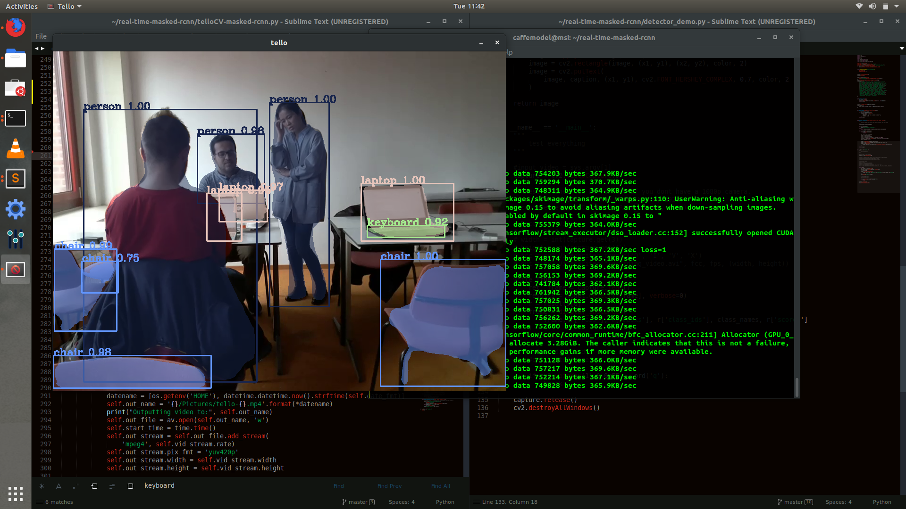

# Mask-RCNN
Implement Real-Time Semantic Segmentation with [Mask_RCNN](https://github.com/matterport/Mask_RCNN).

## Requirements
- Ubuntu 18.04
- Python 3.6
- Tensorflow 1.9
- Keras 2.1.6
- OpenCV 4.0

The algorithm has been tested on the above mentioned configuration, but I'm pretty sure that other combinations would also work effectively. But please make sure that you have TF/Keras combination as mentioned above. Opencv 3.4 would suffice. 

This implementation would work better if you have a GPU in your system and use CUDA-accelerated learning. In a MSI laptop with 1050Ti (4 GB with 768 cuda cores), i5-8220 and 8GB RAM, the FPS obtained is 4.637. 

Also, in order to test it on a Tello, make sure that you have the drone turned on and connected to its WiFi network. Once you esecute this code, press `TAB` to take-off and `BACKSPACE` to land. Other manual navigation commands are given in the header of the python code.

## Getting Started
Install Dependencies (Not Mentioned Above)
```bash
$ sudo -H pip3 install -r requirements.txt
$ sudo -H pip3 install git+https://github.com/philferriere/cocoapi.git#subdirectory=PythonAPI
```

Using pre-trained weights for MS COCO
```bash
It is included in {telloCV-masked-rcnn.py} that downloading the pre-trained weights for MS COCO.
```

Run Demonstration
```bash
$ python3 telloCV-masked-rcnn.py
```
Alternatively, you could download the weights file from [here](https://drive.google.com/file/d/1-18R4Nhsb_-iozR6UVE1J-OCUobDN4my/view?usp=sharing).

<div align="center">
  <a href="https://www.youtube.com/watch?v=RMD8G3Na71s"></a>
</div>

